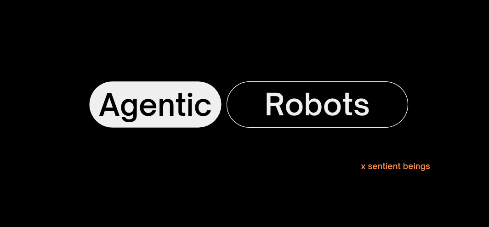

[](http://makeapullrequest.com)
[](http://www.firsttimersonly.com/)

## Agentic Workflow for Robotics 

[Sentient Beings](https://sentient-beings.github.io/) is a open-source organization that is on a mission to build agentic robots. Each project in this organization is designed to be self-contained and we do that by creating a docker container for each project. That includes the dependencies and source code for that project. This helps us get around the "works on my machine" problem.

## Getting Started
This repository focuses on the development of an Agent that can translate the human language to actions. The agent is a simple differential drive robot with a camera and a LIDAR sensor.


https://github.com/user-attachments/assets/75b40912-9e94-4ff3-9a42-97fb67c94e96


## Current Implementation

- [ ] briefly explain the architecture and workflow
- [ ] limitations of the current implementation
- [ ] future work

## Getting Started
- [ ] add docker details
- [ ] add installation instructions

### Running the Demo

1. Launch the simulation environment:
   ```bash
   ros2 launch rabbit_one launch_sim.launch.py  
   ```

2. Start the sensor processing node:
   ```bash
    ros2 run agent_controller sensor_processor
   ```
3. Start the simple controller node:
   ```bash
    ros2 run agent_controller simple_controller
   ```
4. Initialize the redis server:
   ```bash
    redis-server
   ```
5. Run the agent:
   ```bash
    ros2 run conscience agent
   ```
6. Initialize the streamlit app:
   ```bash
   cd conscience
   streamlit run streamlit_app.py
   ```

## Project Structure

- [ ] add project structure


## Future Work

- [ ] add future work
